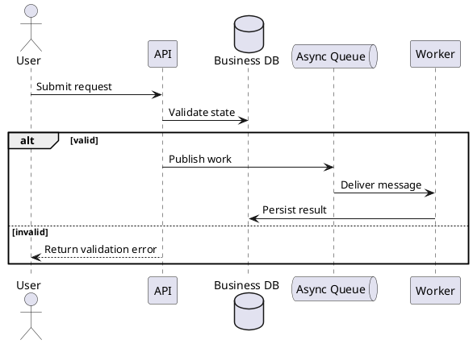

# Deterministic Diagram System

Use this reference before drafting or validating C4 component, AWS
architecture, sequence, or flow diagrams. The goal is repeatable high-quality
output: the same evidence should produce the same view type, notation, palette,
layout, export path, and rejection gates.

## Non-Negotiable Contract

- Choose the view before drawing. Do not mix software structure, cloud topology,
  and runtime ordering in one canvas.
- Prove every node, boundary, relation, actor, queue, database, and runtime step
  from source evidence. Missing evidence blocks the diagram or becomes a
  clearly marked assumption outside the diagram.
- Start from the templates in this file or an existing repo-standard template.
  Do not improvise colors, icon styles, or layout conventions for one diagram.
- Author diagrams only as declarative sources (PlantUML, Mermaid) whose layout
  engine solves node placement. Never draw diagrams with imperative pixel or
  coordinate code such as PIL/Pillow, matplotlib shapes, or raw canvas calls.
  If an existing script hand-draws diagram boxes, arrows, or text, replace it
  with compiled declarative sources instead of patching coordinates; manual
  layout math breaks neighboring elements every time content changes.
- Keep labels short. Node labels are 1-4 words, about 28 characters per line,
  and at most 2 lines. Relationship labels are verb-first and about 4 words.
- Keep icon-macro arguments single-line (for example the AWS macro technology
  argument). An embedded `\n` breaks macro-internal markup and renders literal
  formatting text. Lift shared naming prefixes into the group title and keep
  full resource names in nearby tables.
- Keep long resource names, timings, IDs, evidence, and explanations in nearby
  text or tables, not inside the diagram body.
- When a diagram reports measured results (timings, counts, comparison
  outcomes) as run or validation evidence, generate every measured label from
  the run's data artifact (for example the run's summary/results file) at
  render time, and format missing values as an explicit "n/a". Never hardcode
  a measurement literal in diagram source or generator scripts; keep only
  field names and formatting there, so a re-run re-renders correct labels.
- Use one legend with at most 5 items only when it removes ambiguity. If the
  legend explains ordered runtime behavior, split the view and add a sequence
  diagram.
- Split the diagram when it exceeds about 20 major nodes, 30 relationships,
  multiple abstraction levels, or the target documentation width.
- Export and inspect 100% of generated or embedded image artifacts. Syntax
  success without visual inspection is not acceptable.

## View Selection

| Evidence need | Primary view | Do not include |
|---------------|--------------|----------------|
| Components, ownership, internal dependencies, external systems | C4 component | VPC/subnet topology or numbered request steps |
| Accounts, VPCs, subnets, managed AWS services, storage, messaging, monitoring | AWS architecture | Class/package internals or ordered runtime branches |
| Request lifecycle, callbacks, retries, failures, async handoff, state changes | Sequence | Full infrastructure inventory or icon-heavy topology |
| Manual or operational process with no architecture boundary | Flow/process | Service topology unless needed as context |

When a feature needs all three, create the views in this order: C4 component,
AWS architecture, sequence detail.

## Standard Palette

Use these semantic colors unless the destination repo has a stricter checked-in
diagram theme. Do not introduce one-off colors.

| Semantic role | Fill | Border/text |
|---------------|------|-------------|
| Canvas | `#FFFFFF` | `#1F2937` |
| Muted labels | `#FFFFFF` | `#6B7280` |
| Internal app or service boundary | `#E8F4FD` | `#2E86AB` |
| Data/storage | `#E8F0FF` | `#4E79A7` |
| Async or messaging | `#E8F5E9` | `#59A14F` |
| External system or organization | `#F3F4F6` | `#6B7280` |
| Risk, fallback, or failure path | `#FFF4E5` | `#F28E2B` |

AWS service icons keep their official icon colors. Do not recolor AWS official
icons to fit the palette. Use generic components for app code, third-party
systems, and non-AWS services.

## Layout Rules

- Default left-to-right flow: caller -> ingress/API -> app/service -> async,
  storage, downstream, and observability.
- Create all nodes and boundaries before adding relationships.
- Prefer directionless relationships first. Add directional relationships only
  where needed. Set the layout direction once, globally (`left to right
  direction` in PlantUML, `LAYOUT_LEFT_RIGHT()` in C4-PlantUML). Do not add
  per-edge directional hints such as `-right->` or `-down->` to fix placement
  or overlap: the layout engine fights conflicting hints and moves the
  collision to another edge. Keep edges plain (`-->`) and let the engine
  place them.
- Point every directional edge from the initiator to the responder. A
  query/pull edge starts at the component that issues the query (monitor
  queries datastore: `monitor --> datastore`), not at the data source; a
  reversed query edge misstates the dependency and survives casual review
  because the topology still "looks connected". Verify each edge's initiator
  against source evidence, not against visual flow.
- Keep AWS icons inside boundaries with padding. No icon should sit on a VPC,
  subnet, account, or system-border line.
- Avoid all-enclosing boundaries that add no information. Every boundary must
  mean ownership, trust, account, VPC/subnet, runtime, or deployment scope.
- Avoid crossing arrows through labels. If connectors cross after two layout
  fixes, split the diagram.

## PlantUML Defaults

Use PlantUML for C4 and AWS diagrams when the repo has a renderer or the target
requires icon-quality output.

Security note: PlantUML `!include` URLs are fetched at compile time. Use a
verified local copy of C4-PlantUML or AWS Icons for PlantUML for sensitive,
offline, or reproducible-build work. Use pinned release URLs only when remote
fetching is allowed for the documentation task.

```plantuml
@startuml
skinparam backgroundColor #FFFFFF
skinparam defaultFontName "Arial"
skinparam defaultFontSize 12
skinparam shadowing false
skinparam nodesep 60
skinparam ranksep 90
skinparam dpi 300
@enduml
```

Compile large diagrams with `-DPLANTUML_LIMIT_SIZE=32768`. Prefer SVG. Use PNG
only when the destination requires raster output.

Use `skinparam linetype ortho` only in AWS icon topology diagrams with sparse
connectors. Never add it to C4-PlantUML diagrams: Graphviz orthogonal routing
does not place labels along the routed segments, so `Rel` labels stay detached
or mis-associated from their edges regardless of spacing. Keep
C4 diagrams on default spline routing with `LAYOUT_LEFT_RIGHT()` and
`LAYOUT_WITH_LEGEND()`, and keep `Rel` labels short. If a rendered C4 diagram
shows label overlap, remove `linetype ortho` first instead of tuning spacing or
shortening labels.

## C4 Component Template

Pin C4-PlantUML to a release tag for committed diagrams.

```plantuml
@startuml
!define C4Puml https://raw.githubusercontent.com/plantuml-stdlib/C4-PlantUML/v2.13.0
!include C4Puml/C4_Component.puml

LAYOUT_LEFT_RIGHT()
LAYOUT_WITH_LEGEND()

Person(user, "User")
System_Ext(external, "External System")

System_Boundary(system, "System Name") {
  Container_Boundary(app, "Application") {
    Component(api, "API", "Runtime", "Short responsibility")
    Component(worker, "Worker", "Runtime", "Short responsibility")
  }
  ContainerDb(db, "Database", "Engine", "Stored business state")
  ContainerQueue(queue, "Queue", "Broker", "Async handoff")
}

Rel(user, api, "Calls")
Rel(api, db, "Reads/writes")
Rel(api, queue, "Publishes")
Rel(queue, worker, "Triggers")
Rel(worker, external, "Syncs")
@enduml
```

C4 diagrams show static software structure only. Move ordered behavior, retries,
callbacks, and failure branches to a sequence view.

When a `Rel` label collides with a boundary title and the target node's
description already states the relationship, use a blank label
(`Rel(a, b, " ")`) rather than repeatedly shortening both strings.

## AWS Architecture Template

Pin AWS Icons for PlantUML to a release tag and include only services used by
the diagram.

```plantuml
@startuml
!define AWSPuml https://raw.githubusercontent.com/awslabs/aws-icons-for-plantuml/v23.0/dist
!include AWSPuml/AWSCommon.puml
!include AWSPuml/AWSSimplified.puml
!include AWSPuml/Compute/Lambda.puml
!include AWSPuml/Database/DynamoDB.puml
!include AWSPuml/General/Users.puml
!include AWSPuml/ManagementGovernance/CloudWatch.puml

skinparam backgroundColor #FFFFFF
skinparam shadowing false
skinparam linetype ortho
skinparam nodesep 70
skinparam ranksep 120
left to right direction

Users(users, "Users")

package "AWS Account" {
  package "VPC or Service Boundary" {
    Lambda(api, "API Lambda")
    DynamoDBTable(table, "Business Table")
  }
  CloudWatch(cw, "CloudWatch")
}

users --> api : calls
api --> table : reads/writes
api --> cw : emits metrics
@enduml
```

AWS topology diagrams use sparse verb-labeled connectors. Do not use numbered
runtime arrows in the AWS view. Put numbered request order in surrounding text
or a sequence diagram.

## Sequence Template

Use sequence diagrams for runtime evidence and branch behavior.



Show retries, callbacks, cache hits/misses, and failure paths with `alt`,
`else`, `loop`, and `par`. Do not hide material upstream or downstream state
when it explains the lifecycle.

## Mermaid Defaults

Use Mermaid for simple portable diagrams and sequence views when icon fidelity
is not required. Prefer SVG export.

```json
{
  "securityLevel": "strict",
  "theme": "base",
  "themeVariables": {
    "background": "#FFFFFF",
    "primaryColor": "#E8F4FD",
    "primaryBorderColor": "#2E86AB",
    "primaryTextColor": "#1F2937",
    "lineColor": "#2E86AB",
    "fontFamily": "Arial"
  },
  "flowchart": { "htmlLabels": false, "curve": "basis", "padding": 16 },
  "architecture": { "randomize": false }
}
```

Avoid Mermaid architecture diagrams for final AWS documentation when official
AWS icons or high-fidelity cloud topology are required.

## Rejection Gates

Reject and rework the diagram when any item is true:

- A node, boundary, edge, or runtime step lacks source evidence.
- The view mixes C4 structure, AWS topology, and sequence order.
- Labels overlap, arrows cross labels, icons touch boundaries, or text is
  clipped in the exported artifact.
- AWS architecture uses numbered runtime arrows, long notes, report tables, or
  stale/non-official service icons when official icons are available.
- The canvas depends on more than 5 semantic colors or a legend longer than 5
  items.
- The image is blurry, low-resolution, too wide for target review, or not
  inspected after export.
- The target viewer cannot render the chosen format and no acceptable export was
  verified.

## Source Notes

This system is based on official AWS Architecture Icons guidance, C4 model
notation principles, C4-PlantUML layout guidance, Mermaid deterministic
configuration support, PlantUML renderer/layout capabilities, and AWS guidance
that sequence diagrams model ordered distributed-system behavior from text DSLs.
