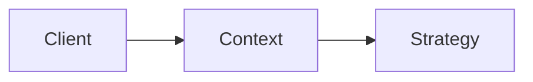

# Fixture overview

See the [root README](../README.md#fixture), the [generated page](05-code-by-component.md#1-strategy-interface)
and the [diagram source](diagrams/overview.mmd).
External: [site](https://example.com/docs), [mail](mailto:dev@example.com), [top](#fixture-overview).



<!-- source: javascript/src/strategy.js -->
```javascript
// Strategy contract of the fixture repo.
export const greeting = (name) => `Hello, ${name}`;
```
